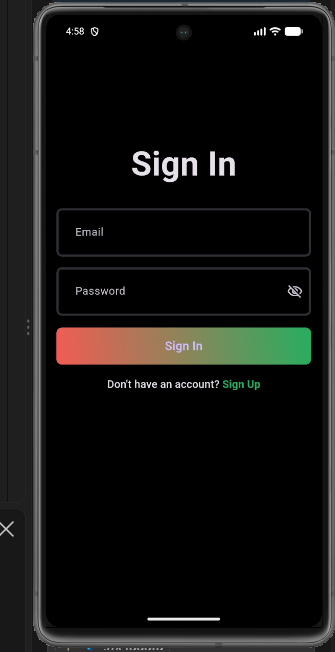
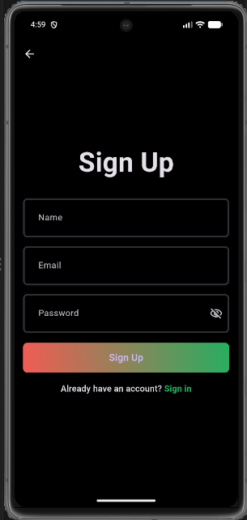
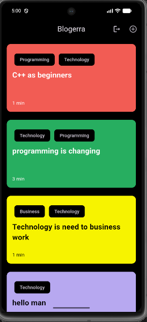
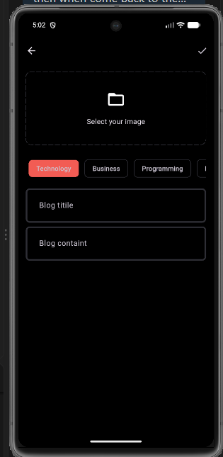

# Blogerra

Blogerra is a Flutter blogging app for discovering, reading, and publishing blog posts. Users can create an account, sign in, browse posts by topic, read full articles, and add new posts.

The app uses a colorful card-based interface with a dark background and supports persistent authentication, remote blog data, local caching, and image selection for new posts.

## Screenshots

### Authentication

| Sign in | Sign up |
| --- | --- |
|  |  |

### Blog experience

| Blog feed | Add a blog |
| --- | --- |
|  |  |


## Features

- Email and password sign up and sign in
- Persistent login session restoration
- Blog feed with topic labels and reading-time estimates
- Full blog post reader
- Create and publish new blog posts
- Image selection for blog posts
- Local blog caching with Hive
- Supabase authentication, database, and storage integration
- Logout with return to the sign-in screen

## Built With

- Flutter and Dart
- Supabase
- Flutter BLoC
- Hive
- GetIt
- fpdart
- image_picker

## Getting Started

### Prerequisites

- Flutter SDK
- Dart SDK compatible with the project
- Android Studio or another Flutter-supported development environment
- A Supabase project

### Installation

```bash
git clone <your-repository-url>
cd blog_app
flutter pub get
flutter run
```

Before running the app, add your Supabase URL and publishable/anonymous key to the project secrets configuration used by `init_dependencies.dart`.

## Project Structure

```text
lib/
|- core/       # Shared theme, errors, networking, utilities, and services
|- features/
|  |- auth/    # Authentication data, domain, Bloc, and screens
|  `- blog/    # Blog data, domain, Bloc, and screens
`- main.dart   # Application entry point
```

## Run on a Connected Device

```bash
flutter devices
flutter run -d <device-id>
```

For example, Android Emulator:

```bash
flutter run -d emulator-5554
```
